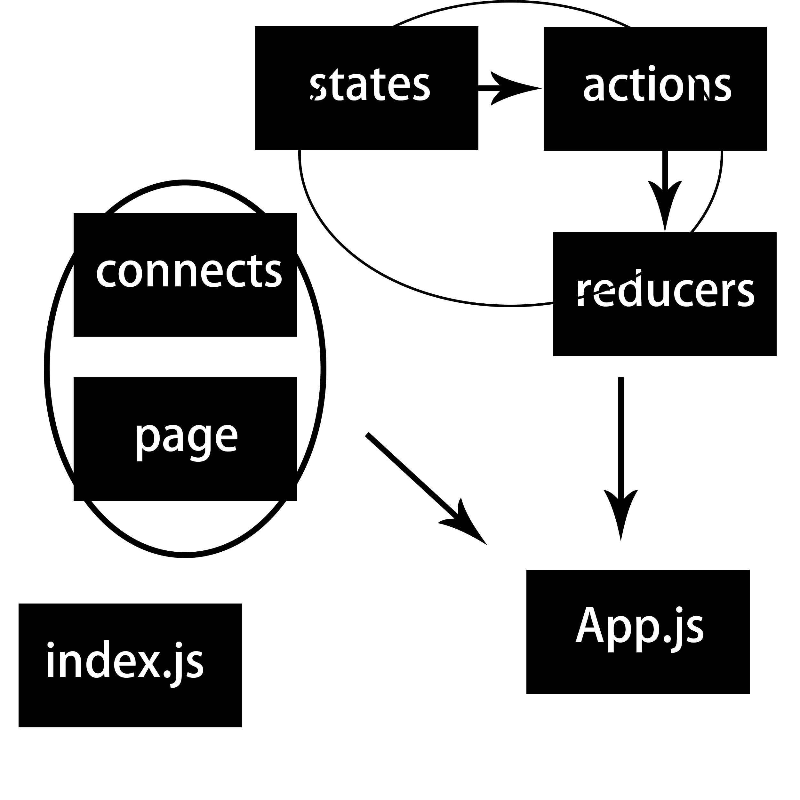

# react-redux 学习总结

## 目录结构

1. 首先用 react-create-app 创建一个项目，`npm run eject` 将隐藏的 `webpack` 配置文件显示，并根据自己需要做一个配置。删除不必要的文件，更改目录结构；
2. 目录结构如下图所示：


3. `./public` 用来存放 `index.html` 文件；业务相关文件存放在 `./src` 文件夹内；
4. 最核心的 `src` 文件夹目录结构如下：

    1. `./actions` 用来存放项目中所有的 `action`；
    2. `./base` 用来存放项目中所有的公共组件，这个项目里有个 `nav` 组件；
    3. `./common` 用来存放项目中的公共资源，包括 `./images`、`./styles`和`./js`；
    4. `./connects` 用来存放项目中使用 `react-redux` 进行连接生成的容器组件；
    5. `./page` 用来存放项目中所有的展示组件；
    6. `./reducers` 用来存放项目中所有的 `reducer` 函数；
    7. `./states` 用来存放项目中最初的 `state`；
    8. `App.js` 根组件，配合 `Router` 进行路由；
    9. `index.js` 入口文件；

## 项目架构

整体如下图所示



`states` 通过 `actions` 派发给 `reducers，由` `react-redux` 的 `Provider` 组件传递到各个由 `react-redux` 连接的容器组件，最后由 `index.js` 入口文件进行输出，同时在 App.js 处进行汇合路由

## 具体实现

主要看列表页的实现

### state

`./states/index.js`
``` JavaScript
export const newsinit = {
  list: [
    {id: 1, title: '隔壁老王的故事', con: '那是一个风和日丽的春天，微风吹着柳树欢快地唱着歌...'},
    {id: 2, title: '老王的绿帽危机', con: '夏天到了，毒日头整天在半空晃悠，我们的老王挺着中年必备的肚子走在行色匆匆的人群中...'},
    {id: 3, title: '老宋的逆袭之路', con: '老宋单名一个喆，咋一看就像一个叽叽，事实上他也是一个用叽叽思考的男人...'},
    {id: 4, title: '小马的厚颜无耻', con: '小马，一个因为老王而从乡下来到城市发展的妹子，她还有一个名字——绿茶婊，代表了一个人群——田园女性主义者...'},
    {id: 5, title: '王宋马三角传奇', con: '这其实不是三个人的传奇，而是老王一个人的传奇，我们可以从中看到一个男人的坚强以及不屈，画外音“有钱真好”...'}
  ]
};
```

### action

`./actions/index.js`
``` JavaScript
export const SORT_REVERSE = 'SORT_REVERSE';
```
该动作主要实现列表页的正序与倒序排列

### reducer

`./reducers/newsReducer.js`
``` JavaScript
import { SORT_REVERSE } from '../actions';
import { newsinit } from '../states';

function newsReducer (state = newsinit, action) {
  switch (action.type) {
    case SORT_REVERSE:
      var arr = state.list;
      var arr2 = [];
      for (var i=arr.length-1; i>=0; i--) {
        arr2.push(arr[i])
      }
      return Object.assign({}, state, {list: arr2})
    default:
      return state;
  }
}

export default newsReducer;
```

### page

`./page/news/News.js`

主要是简单地组件实现，这里略过

### connect

`./connects/newsConnect.js`
``` JavaScript
import { connect } from 'react-redux';
import { SORT_REVERSE } from '../actions';

// 引入组件
import News from '../page/news/News';

// react-redux 封装组件
// 组件通过 props 所要获取的 state
function mapStateToProps (state) {
  return {
    list: state.NewsReducer.list,
    isLogin: state.isLogin
  };
}

// 组件通过 props 所要获取的 actions
function mapDispatchToProps (dispatch) {
  return {
    SORTREVERSE: function () {
      dispatch({type: SORT_REVERSE});
    }
  }
}

// 封装传递 dispatch 和 state
var NewsConnect = connect(mapStateToProps, mapDispatchToProps)(News);

export default NewsConnect;
```

然后就是在 `App.js` 里面引入，以及入口文件 `index.js` 的处理。

## [git仓库](https://github.com/sethvoler/react-redux-pro)，[deom地址](voler.store)
