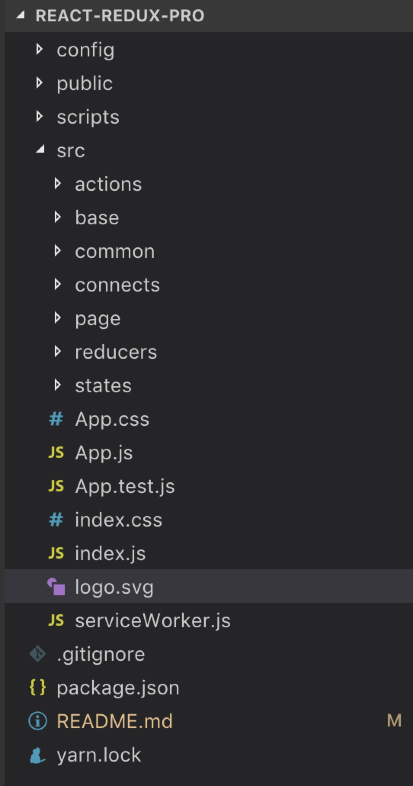

# react-redux 学习总结

## 目录结构

1. 首先用 react-create-app 创建一个项目，`npm run eject` 将隐藏的 `webpack` 配置文件显示，并根据自己需要做一个配置。删除不必要的文件，更改目录结构；
2. 目录结构如下图所示：

3. `./public` 用来存放 `index.html` 文件；业务相关文件存放在 `./src` 文件夹内；
4. 最核心的 `src` 文件夹目录结构如下：

    1. `./actions` 用来存放项目中所有的 `action`；
    2. `./base` 用来存放项目中所有的公共组件，这个项目里有个 `nav` 组件；
    3. `./common` 用来存放项目中的公共资源，包括 `./images`、`./styles`和`./js`；
    4. `./connects` 用来存放项目中使用 `react-redux` 进行连接生成的容器组件；
    5. `./page` 用来存放项目中所有的展示组件；
    6. `./reducers` 用来存放项目中所有的 `reducer` 函数；
    7. `./states` 用来存放项目中最初的 `state`；
    8. `App.js` 根组件，配合 `Router` 进行路由；
    9. `index.js` 入口文件；

## 项目架构

